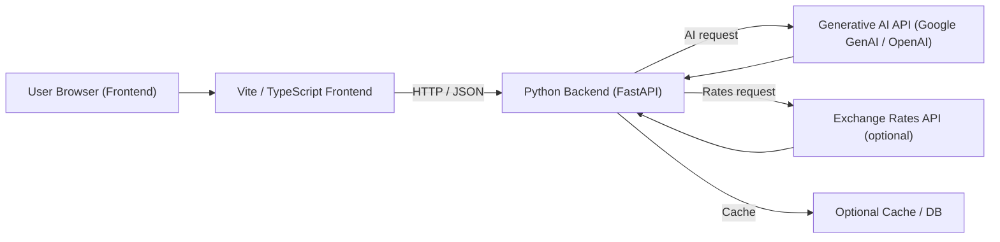

# ai-currency-converter

A minimal full-stack example that demonstrates a TypeScript (Vite) frontend and a Python (FastAPI-ready) backend which can be extended to use a generative AI service for enhancing currency-conversion results.


[](https://github.com/VikashKumar1424/ai-currency-converter)
[](https://github.com/VikashKumar1424/ai-currency-converter)


Table of Contents
- [About](#about)
- [Features](#features)
- [Architecture](#architecture)
- [Tech stack](#tech-stack)
- [Prerequisites](#prerequisites)
- [Quickstart](#quickstart)
  - [Backend (Python)](#backend-python)
  - [Frontend (TypeScript / Vite)](#frontend-typescript--vite)
  - [Run both (development)](#run-both-development)
- [Environment variables](#environment-variables)
- [Testing](#testing)
- [Deployment](#deployment)
- [Troubleshooting](#troubleshooting)
- [Contributing](#contributing)
- [License](#license)


About
-----

This repository contains a frontend app (frontend/) built with TypeScript and Vite, and a Python backend (backend/) that is structured to use FastAPI and generative AI libraries. The project is intended as a starting point for building an AI-assisted currency converter: the backend can call an external AI API (for example Google GenAI or OpenAI) and/or an exchange rates API, while the frontend provides a UI to request conversions.


Features
--------
- Frontend: Vite + TypeScript project scaffold (dev/build/preview scripts in frontend/package.json)
- Backend: Python project using pyproject.toml (dependencies include fastapi, google-genai, uvicorn)
- Ready to extend with an external AI provider and a currency rates provider


Architecture
------------

Mermaid diagram (render in GitHub or other Mermaid-capable renderers):



ASCII fallback:

Browser -> Frontend (Vite/TS)
Frontend -> Backend (HTTP/JSON)
Backend -> External AI APIs (Google GenAI / OpenAI)
Backend -> Exchange Rates API (optional)
Backend -> Cache / DB (optional)


Tech stack
----------
- Frontend: TypeScript, Vite
- Backend: Python (pyproject.toml), FastAPI (dependency present), uvicorn for serving
- AI client: google-genai (listed in backend/pyproject.toml)
- Dev/test: pytest, httpx (dev dependencies)


Prerequisites
-------------
- Node.js 16+ and npm (or pnpm/yarn) for the frontend
- Python 3.12+ (pyproject requires >=3.12)
- Git
- API credentials (for the AI provider and optional exchange rates provider) if you want to exercise that functionality


Quickstart
----------

Clone the repository:

```bash
git clone https://github.com/VikashKumar1424/ai-currency-converter.git
cd ai-currency-converter
```

Backend (Python)
-----------------

1. Change into the backend folder and create a virtual environment:

```bash
cd backend
python -m venv .venv
# macOS / Linux
source .venv/bin/activate
# Windows PowerShell
# .\.venv\Scripts\Activate.ps1
```

2. Upgrade pip and install the package and dependencies defined in pyproject.toml:

```bash
python -m pip install --upgrade pip
pip install .
# For development extras (tests etc): pip install "[dev]" if defined
```

3. Configure environment variables: create `backend/.env` (see [Environment variables](#environment-variables)).

4. Run the backend:

- The project defines a console script `backend = "backend:main"` in pyproject.toml. After installing, you can run:

```bash
backend
```

This will run the package `backend`'s `main()` function (the repository currently includes a placeholder implementation that prints a message). If you implement a FastAPI app in the backend, use uvicorn to run it. Example (replace the import path with the actual module exposing the FastAPI `app`):

```bash
uvicorn backend.src.backend:app --reload --port 8000
```

If uvicorn import fails, inspect backend/src to find the module that exposes `app = FastAPI()` and update the import path accordingly.

Frontend (TypeScript / Vite)
---------------------------

1. Change into the frontend folder and install dependencies:

```bash
cd ../frontend
npm install
# or pnpm install
# or yarn install
```

2. Create a frontend environment file `frontend/.env.local` and set the API base URL (example below):

```env
VITE_API_BASE_URL=http://localhost:8000
```

3. Start the dev server:

```bash
npm run dev
```

Open the URL printed by Vite (commonly http://localhost:5173).

Run both (development)
----------------------

1. Start the backend (port 8000): `cd backend` and run the console script or `uvicorn` as above.
2. Start the frontend (Vite dev server): `cd frontend` and `npm run dev`.
3. If you encounter CORS issues, either enable CORS in the backend or use a Vite proxy. Example Vite proxy snippet in `vite.config.ts`:

```ts
export default defineConfig({
  server: {
    proxy: {
      '/api': {
        target: 'http://localhost:8000',
        changeOrigin: true,
        secure: false,
      }
    }
  }
});
```


Environment variables
---------------------
Create `backend/.env` and `frontend/.env.local` as needed. Example backend `.env`:

```env
# backend/.env
GENAI_API_KEY=your_genai_api_key_here
OPENAI_API_KEY=your_openai_api_key_here
EXCHANGE_RATES_API_KEY=your_rates_api_key_here
PORT=8000
```

Example frontend `.env.local`:

```env
VITE_API_BASE_URL=http://localhost:8000
```


Testing
-------

Backend tests (if any) can be run with pytest. From repository root:

```bash
cd backend
pytest
```


Deployment
----------
- Frontend: build with `cd frontend && npm run build` and serve the `dist` directory with a static web server or include as static assets in the backend.
- Backend: containerize or deploy to any Python-capable hosting. Ensure environment variables are set and that network routing/CORS are configured.

Optional: create Dockerfiles for frontend and backend and a `docker-compose.yml` that wires ports and env vars.

Troubleshooting
---------------
- Backend prints "Hello from backend!" when running the packaged console script — this indicates the `backend:main` entrypoint is installed and working. If you expect an API, implement and expose a FastAPI `app` instance in `backend/src`.
- Import errors on uvicorn: double-check the Python package import path and the module that contains the `app` object.
- Port conflicts: choose different ports or stop services occupying the port.
- CORS: configure FastAPI's CORS middleware or use Vite proxy during development.

Contributing
------------
Contributions are welcome. Please open issues and PRs. When opening a PR, include steps to reproduce and/or tests.

License
-------
Specify a license for the project (e.g., MIT). Add a LICENSE file to the repo.


Acknowledgements
----------------
This template is provided to help onboard new contributors and to document how to run and extend this example project.
